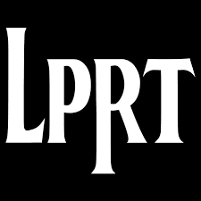

# Little People's Repertory Theatre Digital Archive
A digital archive of images, videos, media links, and metadata related to Little People's Repertory Theatre (LPRT), an ongoing summer theatre program for children ages 8-14, located in Ben Lomond, California, since 1988. For more information on LPRT, see https://lprt.org/.

